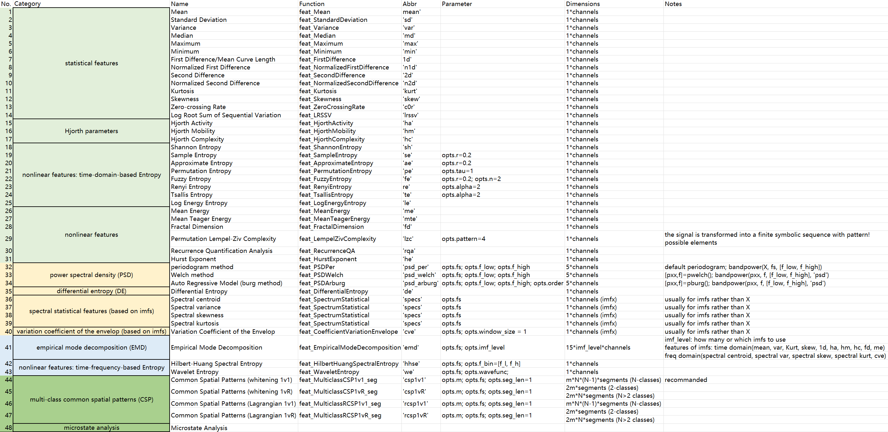

# 脑电特征提取工具箱 | All-In-One EEG Feature Extraction Toolbox

I’m trying to make an all-in-one EEG feature extraction toobox, including statistical features, Hjorth parameters, entropy, nonlinear features, power spectral density (PSD), differential entropy (DE), empirical mode decomposition (EMD), common spatial patterns (CSP), microstate analysis and so on. (The list of features will continue to update...)

## List of available features



1. 时域特征 | time domain 
    1. 统计特征 | statistical features
        1. (1) Mean      'am'    [@feat_Mean](feat_Mean.m)
        2. (2) Standard Deviation      'sd'    [@feat_StandardDeviation](feat_StandardDeviation.m)
        3. (3) Variance   'var'   [@feat_Variance](feat_Variance.m)
        4. (4) Median     'md'    [@feat_Median](feat_Median.m)
        5. (5) Maximum    'max'   [@feat_Maximum](feat_Maximum.m)
        6. (6) Minimum    'min'   [@feat_Minimum](feat_Minimum.m)
        7. (7) First Difference/Mean Curve Length    '1d'    [@feat_FirstDifference](feat_FirstDifference.m)
        8. (8) Normalized First Difference     'n1d'   [@feat_NormalizedFirstDifference](feat_NormalizedFirstDifference.m)
        9. (9) Second Difference   '2d'    [@feat_SecondDifference](feat_SecondDifference.m)
        10. (10) Normalized Second Difference    'n2d'   [@feat_NormalizedSecondDifference](feat_NormalizedSecondDifference.m)
        11. (11) Kurtosis     'kurt'  [@feat_Kurtosis](feat_Kurtosis.m)
        12. (12) Skewness     'skew'  [@feat_Skewness](feat_Skewness.m)
        13. (13) Zero-crossing Rate     'c0r'   [@feat_ZeroCrossingRate](feat_ZeroCrossingRate.m)
        14. (14) Log Root Sum Of Sequential Variation       'lrssv'        [@feat_LRSSV](feat_LRSSV.m)
    2. Hjorth parameters
        1. (15) Hjorth Activity     'ha'    [@feat_HjorthActivity](feat_HjorthActivity.m)
        2. (16) Hjorth Mobility     'hm'    [@feat_HjorthMobility](feat_HjorthMobility.m)
        3. (17) Hjorth Complexity   'hc'    [@feat_HjorthComplexity](feat_HjorthComplexity.m)
    3. 非线性特征：基于时域的熵 | nonlinear features: time-domain-based entropy
        1. (18) Shannon Entropy    'sh'    [@feat_ShannonEntropy](feat_ShannonEntropy.m)
        2. (19) Sample Entropy         'se'    [@feat_SampleEntropy](feat_SampleEntropy.m)
        3. (20) Approximate Entropy    'ae'    [@feat_ApproximateEntropy](feat_ApproximateEntropy.m)
        4. (21) Permutation Entropy    'pe'    [@feat_PermutationEntropy](feat_PermutationEntropy.m)
        5. (22) Fuzzy Entropy      'fe'    [@feat_FuzzyEntropy](feat_FuzzyEntropy.m)
        6. (23) Renyi Entropy      're'    [@feat_RenyiEntropy](feat_RenyiEntropy.m)
        7. (24) Tsallis Entropy    'te'    [@feat_TsallisEntropy](feat_TsallisEntropy.m)
        8. (25) Log Energy Entropy     'le'    [@feat_LogEnergyEntropy](feat_LogEnergyEntropy.m)
    4. 非线性特征 | nonlinear features
        1. (26) Mean Energy        'me'        [@feat_MeanEnergy](feat_MeanEnergy.m)
        2. (27) Mean Teager Energy     'mte'   [@feat_MeanTeagerEnergy](feat_MeanTeagerEnergy.m)
        3. (28) Fractal Dimension      'fd'    [@feat_FractalDimension](feat_FractalDimension.m)
        4. (29) Permutation Lempel-Ziv Complexity      'plzc'       [@feat_PLempelZivComplexity](feat_PLempelZivComplexity.m)
        5. (30) Recurrence Quantification Analysis     'rqa'    [@feat_RecurrenceQA](feat_RecurrenceQA.m)
        6. (31) Hurst Exponent          'he'    [@feat_HurstExponent](feat_HurstExponent.m)
2. 频域特征 | frequency domain
    1. 功率谱密度 | power spectral density（average band power） 
        1. (32) Periodogram      'psd_per'   [@feat_PSDPer](feat_PSDPer.m)  
        2. (33) Welch      'psd_welch'         [@feat_PSDWelch](feat_PSDWelch.m)
        3. (34) Auto Regressive Model (burg)   'psd_arburg'    [@feat_PSDArburg](feat_PSDArburg.m)  
    2. 微分熵 | differential entropy (DE)
        1. (35) Differential Entropy   'de'    [@feat_DifferentialEntropy](feat_DifferentialEntropy.m)
    3. 基于IMFs的谱统计特征 | spectral statistical features (based on imfs)
        1. (36) Spectral centroid      'specs'     [@feat_SpectrumStatistical](feat_SpectrumStatistical.m)
        2. (37) Spectral variance      'specs'     [@feat_SpectrumStatistical](feat_SpectrumStatistical.m)
        3. (38) Spectral skewness      'specs'     [@feat_SpectrumStatistical](feat_SpectrumStatistical.m)
        4. (39) Spectral kurtosis      'specs'     [@feat_SpectrumStatistical](feat_SpectrumStatistical.m)
    4. 包络变异系数 | Variation Coefficient of the Envelope (CVE)
        1. (40) Variation Coefficient of the Envelope   'cve'    [@feat_CoefficientVariationEnvelope](feat_CoefficientVariationEnvelope.m)
3. 时频特征 | time-frequency domain
    1. 经验模态分解 | empirical mode decomposition (EMD)
        1. (41) Empirical Mode Decomposition   'emd'   [@feat_EmpiricalModeDecomposition](feat_EmpiricalModeDecomposition.m)
    2. 非线性特征：基于时频的熵 | nonlinear features: time-frequency-based entropy
        1. (42) Hilbert-Huang Spectral Entropy     'hhse'   [@feat_HilbertHuangSpectralEntropy](feat_HilbertHuangSpectralEntropy.m)
        2. (43) Wavelet Entropy   'we'     [@feat_WaveletEntropy](feat_WaveletEntropy.m)
4. 空域特征 | spatial domain
    1. 共空间模式 | common spatial patterns (CSP)  （不可在main中调用，仅可单独使用）
        1. (44) Common Spatial Patterns (whitening one vs. one)   'csp1v1'   [@feat_MulticlassCSP1v1_seg](feat_MulticlassCSP1v1_seg.m)   default
        2. (45) Common Spatial Patterns (whitening one vs. rest)   'csp1vR'   [@feat_MulticlassCSP1vR_seg](feat_MulticlassCSP1vR_seg.m)
        3. (46) Common Spatial Patterns (Lagrangian one vs. one)   'rcsp1v1'  [@feat_MulticlassRCSP1v1_seg](feat_MulticlassRCSP1v1_seg.m)
        4. (47) Common Spatial Patterns (Lagrangian one vs. rest)   'rcsp1vR'  [@feat_MulticlassRCSP1vR_seg](feat_MulticlassRCSP1vR_seg.m)
    2. 微状态分析 | microstate analysis   （不可在main中调用，仅可单独使用）
        1. (48) Microstate Analysis 

## Inputs

- `X`: single channel EEG signal (either a row vector or a column vector)
- `opts`: necessary or optional parameters for each feature extraction function (refer to the ‘*Parameter*’ column of [List of available features](#list-of-available-features))

## Outputs

- `feature`: extracted feature vector or feature matrix (the dimension of `feature` is listed in ‘*Dimensions*’ column of [List of available features](#list-of-available-features))

## Examples: [demo](demo.m)

- You can **call and test each feature extraction function separately**. Here we take the ‘psd’ (power spectral density) and ‘emd’ (empirical mode decomposition) function as examples:
    
    ```matlab
    load('X.mat');      % single channel EEG signal (either a row vector or a column vector)
    
    % power spectral density (PSD), welch method
    opts.fs = 128;    % sampling frequency
    opts.f_low = 1; opts.f_high = 45;   % frequency range
    PSD = feat_PSDWelch(X, opts);   disp(PSD);
    
    % empirical mode decomposition (EMD)
    opts.imf_level = 3;     % extracted maximum number of intrinsic mode functions
    imf_features = feat_EmpiricalModeDecomposition(X, opts);    disp(imf_features);
    ```
    
- You can also use the [feat_main](feat_main.m) function to extract multiple features at once. The idea of `feat_main.m` comes from https://github.com/JingweiToo/EEG-Feature-Extraction-Toolbox
    
    ```matlab
    load('X.mat');      % single channel EEG signal (either a row vector or a column vector)
    
    opts.fs = 128;      % sampling frequency
    opts.f_low = 1; opts.f_high = 45;   % feat_PSDPer, feat_PSDWelch, feat_PSDArburg
    opts.imf_level = 3;         % fet_EmpiricalModeDecomposition
    opts.f_bin = [1 45];        % fet_HilbertHuangSpectralEntropy
    opts.wavefunc = 'db4';      % feat_WaveletEntropy
    
    feature_abbr = {'mean','sd','var','md','max','min','1d','n1d','2d','n2d','kurt','skew','c0r','lrssv','ha','hm','hc','sh','se','ae','pe','fe','re','te','le','me','mte','fd','plzc','psd_welch','de','emd','hhse','we'}; % 34
    feature_set = [];   % 104
    for feat = 1:length(feature_abbr)
        % disp(feature_abbr{feat});
        feature_set = [feature_set feat_main(feature_abbr{feat}, X, opts)];
    end
    ```
    
- The usage of multiclass Common Spatial Patterns function [feat_MulticlassCSP1v1_seg](feat_MulticlassCSP1v1_seg.m) is different from others. Details can be found in `feat_MulticlassCSP1v1_seg.m`
    
    ```matlab
    load('EEG.mat')   % data from SEED datasset, EEG_train and EEG_test, times=1000, channels=62, nbClasses=3
    %   EEG_train: 训练集各类别的所有trials：
    %       EEG_train.x: EEG，times*channels*trials
    %       EEG_train.y: 训练集所有样本的类别标签，trials*1
    %   EEG_test: 测试集各类别的所有trials：
    %       EEG_test.x: EEG，times*channels*trials
    %       EEG_test.y: 测试集所有样本的类别标签，trials*1
    opts.fs = 200;
    opts.m = 4;     % number of CSP filters, dimensions of CSP features are 2m, m<channels
    opts.seg_len = 1;   % length of each segments，sec
    [feature_train, feature_test, CSPMatrix] = feat_MulticlassCSP1v1_seg(EEG_train, EEG_test, opts);
    % feature_train: (trials, m*nbClasses*(nbClasses-1), nsegments)
    ```
    

## References

- [1] Zhang, Z. (2019). Spectral and Time-Frequency Analysis. In: Hu, L., Zhang, Z. (eds) EEG Signal Processing and Feature Extraction. Springer, Singapore. [https://doi.org/10.1007/978-981-13-9113-2_6](https://doi.org/10.1007/978-981-13-9113-2_6)
- [2] Jia, H. (2019). Microstate Analysis. In: Hu, L., Zhang, Z. (eds) EEG Signal Processing and Feature Extraction. Springer, Singapore. [https://doi.org/10.1007/978-981-13-9113-2_8](https://doi.org/10.1007/978-981-13-9113-2_8)
- [3] Bai, Y., Li, X., Liang, Z. (2019). Nonlinear Neural Dynamics. In: Hu, L., Zhang, Z. (eds) EEG Signal Processing and Feature Extraction. Springer, Singapore. [https://doi.org/10.1007/978-981-13-9113-2_11](https://doi.org/10.1007/978-981-13-9113-2_11)
- [4] Jenke, R., Peer, A., and Buss, M. (2014). Feature Extraction and Selection for Emotion Recognition from EEG. IEEE Transactions on Affective Computing 5, 327–339. doi: 10.1109/TAFFC.2014.2339834.
- [5] [Jx-EEGT : Electroencephalogram ( EEG ) Feature Extraction Toolbox](https://github.com/JingweiToo/EEG-Feature-Extraction-Toolbox)
- [6] [eegbook](https://github.com/zhangzg78/eegbook)
- [7] [脑电EEG代码开源分享【文档+代码+经验】_Coco恺撒的博客-CSDN博客](https://blog.csdn.net/weixin_44425788/category_12026253.html)
